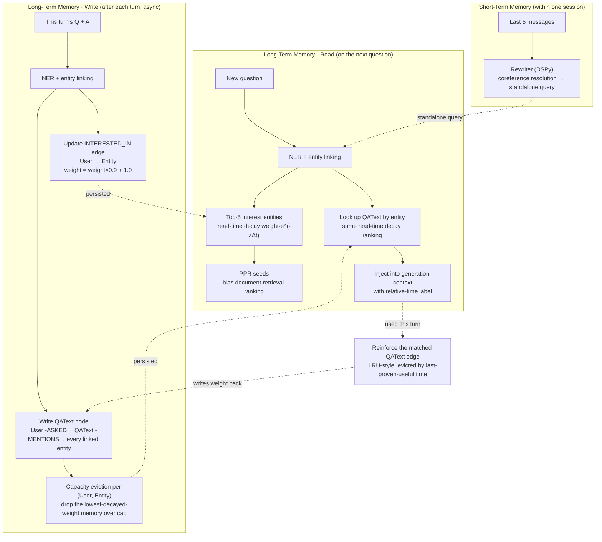
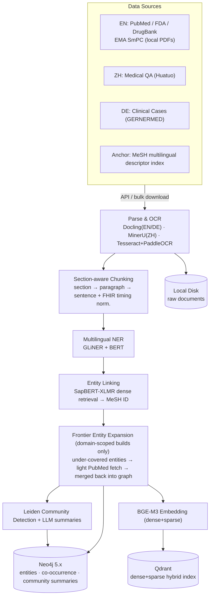

# 🧬 MedGraphia

A multilingual (English, Chinese, German) medical QA system built on an **Agentic GraphRAG**
architecture, achieving deep cross-lingual alignment via the MeSH ontology. The system combines
time-decayed long/short-term memory, multi-tier LLM intelligent routing, and DSPy-optimized prompt
management into a safe, traceable clinical AI brain.

Inspired by recent GraphRAG research (UnWeaver, LinearRAG, HippoRAG2, among others), this project
replaces costly LLM-based relation extraction with a **bipartite entity-chunk graph + PPR-style
propagation** for structured multi-hop reasoning — it is the graph's **connectivity structure**,
not the semantics of typed edges, that drives multi-hop reasoning.

The knowledge graph **expands in real time** as users ask questions: it starts from a graph built on
a base medical corpus, then grows either by proactively fetching incremental literature for a named
entity, or — when a question touches an entity absent from the graph — by having the agentic system
automatically retrieve the relevant papers and merge them into the graph on the fly (optimized down
to roughly 10 seconds of added latency), so the graph keeps getting stronger the more it is used.

[](https://www.python.org/)
[](https://fastapi.tiangolo.com/)
[](docker-compose.yml)
[](https://neo4j.com/)
[](https://qdrant.tech/)
[](https://langchain-ai.github.io/langgraph/)
[](#-features)
[](LICENSE)

---

## 📋 Table of Contents

- [Features](#-features)
- [Architecture](#-architecture)
- [Knowledge Graph Schema](#-knowledge-graph-schema)
- [Tech Stack](#-tech-stack)
- [How It Works](#️-how-it-works)
- [Deployment](#-deployment)
- [Installation](#-installation)
- [Usage](#-usage)
- [RAGAS Evaluation](#-ragas-evaluation)
- [Performance and Engineering Optimization](#-performance-and-engineering-optimization)
- [Configuration](#-configuration)
- [Project Structure](#-project-structure)
- [License & Contact](#-license--contact)

---

## ✨ Features

| Feature                                                         | Description                                                                                                                                                                                                                                                                                                                                                                                                                                                                                                                                                                                                                                                                                                                                                                                                       |
|-----------------------------------------------------------------|-------------------------------------------------------------------------------------------------------------------------------------------------------------------------------------------------------------------------------------------------------------------------------------------------------------------------------------------------------------------------------------------------------------------------------------------------------------------------------------------------------------------------------------------------------------------------------------------------------------------------------------------------------------------------------------------------------------------------------------------------------------------------------------------------------------------|
| 🧠 Advanced GraphRAG Engine | A deep implementation of GraphRAG principles: <br>• **Local Search**: Bipartite entity-chunk graph + Neo4j GDS **Personalized PageRank** for structural multi-hop reasoning — no LLM relation extraction needed, and no relation edges are ever written or read.<br>• **Global Search**: **Leiden algorithm** community detection over entity co-occurrence + LLM-generated hierarchical summaries for cross-corpus synthesis.<br>• **Hybrid RRF**: Merging PPR-ranked chunks, dense/sparse vector search, and community insights via Reciprocal Rank Fusion.<br>• **Semantic Glue**: All data is anchored to MeSH CUIs, enabling the graph to act as a cross-lingual and cross-document relational bridge.                                                                                                       |
| 🌱 Incremental Knowledge Graph Expansion | Lets the graph grow stronger the more it is used, agentically, at two trigger points that share the same NER / entity-linking pipeline:<br>• **Build-Time**: During a domain-scoped build, entities that stay under-covered in the graph trigger a small supplementary PubMed fetch, keeping the graph connected without a full re-crawl.<br>• **Query-Time**: A LangGraph tool-calling loop — before answering, the LLM judges whether the retrieved evidence is missing a connection between key entities, and if so calls a tool that fires a targeted PubMed search to ingest new chunks on the fly. Newly-fetched chunks are folded back into the numbered context, so the final answer can cite them with a real inline `[N]` marker like any other source.                                                 |
| 🌐 Multilingual (ZH / EN / DE) align                            | All surface forms of the same concept ("心肌梗死 / myocardial infarction / Myokardinfarkt") are aligned to a single CUI (MeSH ID) via SapBERT-XLMR for graph retrieval. At query time, **multilingual expansion** (Step 0.5) translates the query into all three corpus languages via `QueryTranslator` and runs parallel per-language Qdrant searches with quota-based merging                                                                                                                                                                                                                                                                                                                                                                                                                                       |
| 🔬️ DSPy-driven Prompt Optimization                    | Use **DSPy** to manage and optimize prompts. Optimization strategies include:<br>• **Automated Prompt Compilation**: Using **GEPA** (reflective prompt evolution, chosen over `MIPROv2` for its far better sample efficiency on our small hand-curated + synthetic datasets) to automatically select and inject the best reasoning traces (CoT) into the prompt.<br>• **Synthetic Data Factory**: Built-in pipeline to reverse-engineer high-quality, multilingual QA pairs from grounded graph chunks.<br>• **Adversarial Tuning**: Defending against false pronouns and hallucinated knowledge via explicitly negative training examples.<br>• **Clinical Tiering**: The Rewriter is trained to simultaneously condense queries and classify their clinical complexity (SMALL/MEDIUM/LARGE) for the LLM Router. |
| ⏳ Long-Short Term Memory System                                 | • **Short-Term:** LLM-based Contextual Query Rewriting resolves pronouns across recent chat turns into standalone queries. <br>• **Long-Term:** Async Neo4j updates build cross-session user profiles: interaction-count reinforcement (`weight × 0.9 + 1.0` on repeat mentions) combined with a lazy **exponential time-decay** (30-day half-life, computed at read time) so stale one-off interests fade, enabling language-agnostic personalization.                                                                                                                                                                                                                                                                                                                                                           |
| 🏥 Two-Stage Cascade NER & Entity Linking                       | GLiNER zero-shot multilingual coarse pass + language-specific BERT precision pass (`biomedical-ner-all` EN, `Adapting/bert-base-chinese-finetuned-NER-biomedical` ZH, `GerMedBERT_NER_V01_BRONCO_CARDIO` DE) → SapBERT-XLMR dense retrieval linking to CUI (MeSH ID)                                                                                                                                                                                                                                                                                                                                                                                                                                                                                                                                              |
| 🏗️ Section-aware Chunking                                      | Text is split based on structural hierarchy (Section → Sub-section → Paragraph) rather than fixed token counts. Each chunk carries a metadata section_path, ensuring contextual grounding during retrieval.                                                                                                                                                                                                                                                                                                                                                                                                                                                                                                                                                                                                       |
| 🔀 Multi-Model LLM Router                                       | Automatically classifies each question into one of three tiers by complexity (**E+I scoring**: entity count + intent depth), then dispatches it to a different LLM model                                                                                                                                                                                                                                                                                                                                                                                                                                                                                                                                                                                                                                          |
| ⚡ vLLM Sleep Mode Tier Switching | Whichever tier the LLM router picks gets its vLLM engine woken in real time; every other tier stays asleep and off the GPU:<br>• **Wake-on-demand**: when the router selects a tier, it calls vLLM's `/wake_up` endpoint to wake that engine if it's asleep, and lets it re-sleep automatically after a period of inactivity.<br>• **VRAM reuse**: a sleeping engine frees 90%+ of its weight and KV-cache memory, letting a single 16GB GPU rotate through multiple tiers (e.g. 3B/9B/14B) instead of keeping them all resident at once.<br>• **Measured numbers**: a 3B model takes ~7s to sleep and frees ~13GB of VRAM, then ~3s to wake and resume inference — an order of magnitude faster than a cold start.                                                                                               |
| 👁️ Multilingual PDF files support (Multi-Engine Parsing & OCR) | Hybrid pipeline using Docling (EN/DE) and MinerU (ZH) for structural layout analysis (tables/formulas). Integrated Tesseract 5 + PaddleOCR fallback for scanned medical records.                                                                                                                                                                                                                                                                                                                                                                                                                                                                                                                                                                                                                                  |
| 🔗 Mandatory Evidence Citations                                 | Every answer is traceable to a specific chunk, section path, and versioned source — unanswerable questions are refused rather than fabricated                                                                                                                                                                                                                                                                                                                                                                                                                                                                                                                                                                                                                                                                     |
| 🛡️ Safety Guardrails                                           | Two-stage proactive defense: Llama Guard input filtering (pre-retrieval) + output moderation (post-generation); aligned with S1-S14 safety categories; mandatory medical disclaimers and automatic model provisioning.                                                                                                                                                                                                                                                                                                                                                                                                                                                                                                                                                                                          |
| 📊 RAGAS Evaluation                                             | Standardized evaluation framework using RAGAS; support for automated synthetic medical testset generation with reasoning evolution; offline evaluation of RAG pipeline metrics (Faithfulness, Relevance, Precision, Recall)                                                                                                                                                                                                                                                                                                                                                                                                                                                                                                                                                                                       |
| ⚡ Redis-Backed NER Result Cache                                | Query-side NER + Entity Linking results (GLiNER → SapBERT-XLMR → MeSH CUI) are persisted in Redis. Repeated or concurrently-identical queries skip BERT inference entirely, cutting routing latency from **2000 ms → 5 ms**.                                                                                                                                                                                                                                                                                                                                                                                                                                                                                                                                                                                      |
| 🔄 Arq Pipeline Task Queue                                      | The offline build pipeline is dispatched as a durable **Arq** task (Redis-backed) executed by a dedicated worker process.                                                                                                                                                                                                                                                                                                                                                                                                                                                                                                                                                                                                                                                                                         |

---

### 🚀 Technical Deep Dives

#### **1. Ingestion Pipeline**

The offline knowledge-graph build pipeline turns raw documents into a structured, query-ready graph and vector database through 9 logical stages; fetching and frontier expansion are configuration-dependent:

1.  **Load**: `StructuredParser` uniformly reads structured JSON under `data/raw` (PubMed, FDA, DrugBank, GerMed) and unstructured local PDFs (EMA SmPC) into internal `RawDocument` objects, giving heterogeneous multi-source data a standardized entry point.
2.  **Parse**: Complex formats (PDFs) go through `DoclingParser`, which extracts content while preserving layout — "layout-aware" data (titles, paragraphs, table hierarchy) that avoids destroying semantic context via brute-force splitting.
3.  **Chunk**: `MedicalChunker` performs section-aware chunking, `MedicalNormalizer` normalizes medical terminology, and both are written to Neo4j. Chunking uses CPU-bound multi-threading (bypassing the GIL) with highly concurrent async I/O for writes, meaningfully raising ingestion throughput.
4.  **NER**: GLiNER zero-/few-shot coarse pass + language-specific medical BERT precision pass extract drugs, diseases, symptoms, and other entities; a chunk-level degrade-and-retry mechanism keeps the pipeline robust against batch failures.
5.  **Link**: `EntityLinker` matches extracted entities to standard MeSH CUIs via a precomputed multilingual SapBERT dense index — the key step for disambiguating entities and normalizing the graph, where the precomputed index trades off alignment accuracy against compute cost.
6.  **Embed**: BGE-M3 produces dense + sparse dual-path vectors per chunk, written to Qdrant as the foundation for downstream hybrid retrieval.
7.  **Community**: Runs the Leiden algorithm over an **entity co-occurrence graph** (entities sharing a chunk are linked, edge weight = shared-chunk count) to detect communities, then has an LLM summarize each cluster and write it back to Neo4j. No relation extraction — clustering runs directly on co-occurrence, following 2025–2026 relation-free GraphRAG research (LinearRAG, AtomicRAG), letting the system answer macro-level queries that need a global view.

#### **2. Relation-Free Multi-Hop Reasoning: Connectivity Instead of Relation Semantics**
Traditional GraphRAG relies on an LLM or a fine-tuned pretrained model to extract typed relation edges (e.g. "Drug -interacts_with→ Drug") — costly, error-prone, and a predefined relation taxonomy can never cover the long tail of medical associations. MedGraphia's core assumption is simpler: **if two entities appear in the same chunk of text, they likely share some medical association**, without needing to know in advance whether that association is "treats," "contraindicated with," or "side effect of."

*   **Build time**: every "co-occurring in the same chunk" entity pair is implicitly linked into a **bipartite graph** (entity nodes + chunk nodes) — no typed relation edge is ever written.
*   **Query time**: Neo4j GDS runs **Personalized PageRank** over this graph, propagating outward from the entities a query hits — chunks reached by shorter, denser co-occurrence paths score higher. This is, in essence, substituting the graph's **connectivity structure** for the **semantics of relation types** to achieve multi-hop reasoning.

#### **3. Cross-Lingual Ontology Alignment**
A unified MeSH ontology + parallel multilingual retrieval achieve deep ZH/EN/DE cross-lingual alignment:

*   **Offline Entity Unification**: After a two-stage cascade NER pass (GLiNER + language-specific BERT) extracts entities, `EntityLinker` uses SapBERT-XLMR to map the same concept's different-language surface forms — "心肌梗死" / "myocardial infarction" / "Myokardinfarkt" — onto one global MeSH CUI (e.g. `D009203`). Neo4j stores edges keyed on this language-agnostic CUI, so a relation extracted from a German document connects directly to a Chinese node.
*   **Online Parallel Retrieval**: At query time, `QueryTranslator` asynchronously translates the user's input into all three corpus languages, and Qdrant runs per-language-quota parallel hybrid search (dense + sparse) before merging via RRF — this is what lets sparse vector matching, which depends on exact token overlap, still hit correctly across language boundaries.

#### **4. Long-Short Term Memory System**
Short-term handles context within a single session; long-term splits into two independently-maintained Neo4j edges — interest weights and conversation content each run their own decay and eviction, with no cascading between the two:

*   **Short-Term**: `Rewriter` (DSPy-optimized) resolves coreference and ellipsis from a 5-message sliding window (~2.5 turns), condensing history into a standalone search query instead of letting the LLM drown in raw transcript.
*   **Long-Term (interest weights)**: User-entity interactions persist to Neo4j's `INTERESTED_IN` relationship, with two stacked decay mechanisms — ① interaction-count reinforcement: each repeat mention does `weight = weight × 0.9 + 1.0`; ② read-time exponential time-decay: computed at query time as `weight × e^(-λΔt)` (30-day half-life, `Δt` from `last_accessed`, no cron job needed). Retrieval seeds PPR with the user's top-5 interest entities — live-verified: under equal starting weights, recently-accessed interests do rank ahead of long-stale ones. Anonymous sessions never write to this mechanism, so different visitors' retrieval results can't cross-contaminate.
*   **Long-Term (conversation content)**: `(User)-[:ASKED]->(QAText)-[:MENTIONS]->(Entity)` brings full Q&A text into the graph as its own edge type, maintained independently of the interest-weight edges above with no cascading deletes between the two. Multi-tenancy isolation comes from the graph shape itself — each `QAText` node has exactly one exclusive ownership edge from its `User`, so retrieval always anchors on a specific `User` node while `Entity` nodes stay globally shared. Capacity is bounded per `(user, entity)` pair with a fixed cap; over-capacity evicts the memory with the lowest decayed weight. Eviction isn't FIFO: a memory that gets retrieved and actually used in a response is reinforced again at read time (LRU-style — evicted by last-proven-useful time, not creation time — so a memory that keeps proving relevant survives regardless of age). Memories injected into the generation context carry a relative-time label (e.g. "3 months ago"), leaving temporal disambiguation to the generator itself rather than running a separate contradiction-detection pass at write time.

The two long-term edges have different write, read, and eviction timing — laid out as a diagram it's easier to follow:



#### **5. DSPy-driven Prompt Self-Evolution**
**DSPy programs** replace static prompts, evolving through automated data-driven compilation:

*   **Synthetic Data Factory**: A Teacher model reverse-engineers high-quality multilingual QA pairs from grounded graph chunks ("Reverse-RAG"), ensuring training examples are anchored in real database evidence.
*   **Optimizer choice — GEPA**: MIPROv2's Bayesian search was the original choice, but its sample efficiency was limited on this project's small hand-curated + synthetic dataset. Switching to **GEPA** (reflective prompt evolution) deliberately puts the reflection model (Gemini) on a different provider from the student model being optimized (DeepSeek) — avoiding the blind spot of a model reflecting on its own output, so reflection gets a genuine outside-observer diagnosis.
*   **Feedback-driven evaluation**: GEPA's metric returns not just a score but a diagnostic string (e.g. "missing citation [2]", "misclassified complexity tier") that the reflection model uses to analyze the failure and rewrite the prompt accordingly — this is the core reason it beats classic Bayesian search on sample efficiency.
*   **Measured results**: The Rewriter went from a baseline of **0.398** to **0.790** after compilation (+0.393); the Generator went from **0.821** to **1.000** (+0.179). The Generator's `answer_metric` is a composite score anchored on **citation density** (penalizing factual statements that lack a supporting `[N]` marker, using a clinical-safe regex that leaves decimals like "pH 7.4" intact), layered with citation-set correctness, inline-citation strictness, and refusal quality, so no single dimension can be gamed.

#### **6. Hierarchical Multi-Model Routing**
`Pydantic-AI`-orchestrated tiered routing, dispatched by an **E+I complexity score**:

*   **Scoring rule**: `Rewriter` computes **entity count E** (1–3) and **intent depth I** (1–3) during rewriting; complexity = E + I. Example: "What are the side effects of metformin?" → E=1 (single entity), I=1 (simple factual lookup) → total 2 → **SMALL** tier. "71-year-old female with renal impairment — precautions for metformin plus contrast agent?" → E=3 (multiple entities + population constraint), I=2 (multi-hop clinical decision) → total 5 → **LARGE** tier.
*   **Tiered dispatch**: total ≤3 → **SMALL** (local low-latency model), 4 → **MEDIUM**, ≥5 → **LARGE** (flagship cloud model) — simple queries don't pay latency for precision they don't need, and only genuinely complex clinical decisions get routed to the strongest model.

#### **7. Parent-Child Document Retrieval (Small Chunk Search, Large Chunk Recall)**
Medical guidelines and FDA labels are long and context-dependent; fixed-size chunking often slices critical evidence (adverse reactions, dosage instructions) mid-sentence. MedGraphia solves this with a dynamic **parent-child retrieval** architecture:

*   **Small chunk search**: documents split into dense sub-chunks (max 300 tokens) for precise vector matching.
*   **Large chunk recall**: once a query hits a child chunk, its full `parent_text` (the complete clinical section) is pulled via Qdrant payload and injected into the LLM context.
*   **Impact**: the generator sees the full clinical picture without re-triggering a database query, eliminating "hard-cutoff" hallucination at the source.

---

## 🎬 Architecture

### Build Pipeline (Offline)



### Query Pipeline

```mermaid
flowchart TD
    INPUT["User Query + Conversation History (Long-Short Memory)"]
    GUARD["Llama-Guard Input Filter<br/>checks S1-S14 violations before retrieval"]
    REWRITE["Query Rewriter<br/>resolves coreference/ellipsis via chat history, condenses into a standalone query"]
    EXPAND["Parallel Multilingual Query Expansion<br/>QueryTranslator: query → ZH/EN/DE<br/>per-language Qdrant quota search → merged pool"]
    ROUTE["LangGraph Router<br/>① Query NER & linking to MeSH CUI<br/>② Intent classification (5 QueryTypes)<br/>③ Retrieval plan generation"]

    subgraph RETRIEVE["Three-Way Parallel Retrieval"]
        direction LR
        GRAPH["Graph Retrieval<br/>Neo4j GDS PPR<br/>bipartite entity-chunk projection"]
        VECTOR["Hybrid Vector Retrieval<br/>BGE-M3 dense+sparse<br/>on Qdrant"]
        COMMUNITY["Community Summary Retrieval<br/>global search over Leiden communities<br/>(multi-hop/overview)"]
    end

    FUSION["RRF Fusion + cloud cross-encoder reranking (Fireworks)<br/>multilingual reranking"]
    LLMROUTE["LLM Router<br/>SMALL(FAQ) / MEDIUM(Inter.) / LARGE(Decis.)<br/>LiteLLM + LangGraph"]
    GAP["Agentic Gap Completion<br/>Two-entity: LLM judges relation gap · Single-entity: reranker flags evidence as noise<br/>triggers targeted PubMed fetch + NER/link ingest of new chunks"]
    GEN["Generation Pipeline<br/>Pydantic-typed prompts · automated inline [N] citations<br/>medical disclaimer & evidence provenance"]
    PERSIST["Post-Processing & Persistence<br/>interaction saved to Neo4j · async user-interest update (long memory)"]
    UI["FastAPI / Streamlit UI<br/>Langfuse tracing & logs"]

    INPUT --> GUARD --> REWRITE --> EXPAND --> ROUTE --> RETRIEVE
    RETRIEVE --> FUSION --> LLMROUTE --> GAP --> GEN --> PERSIST --> UI
```



---

## 🗺️ Knowledge Graph Schema

### Node Types

#### 1. Medical Entities (MeSH-Anchored)
Core knowledge nodes. All medical entities are uniquely identified by their **MeSH CUI**.

| Label | Description | Key Properties |
|---|---|---|
| `Disease` | Clinical conditions / syndromes | `cui`, `label`, `lang_zh`, `lang_de`, `confidence` |
| `Drug` | Substances / pharmaceutical products | `cui`, `label`, `lang_zh`, `lang_de`, `confidence` |
| `Symptom` | Signs and symptoms | `cui`, `label`, `lang_zh`, `lang_de`, `confidence` |
| `Gene` | Genes / proteins / markers | `cui`, `label`, `lang_zh`, `lang_de`, `confidence` |
| `Procedure` | Diagnostic or therapeutic procedures | `cui`, `label`, `lang_zh`, `lang_de`, `confidence` |
| `Anatomy` | Body parts / anatomical structures | `cui`, `label`, `lang_zh`, `lang_de`, `confidence` |
| `Physiology` | Biological processes / phenomena | `cui`, `label`, `lang_zh`, `lang_de`, `confidence` |
| `LivingBeing` | Pathogens / organisms (bacteria, viruses, parasites) | `cui`, `label`, `lang_zh`, `lang_de`, `confidence` |

#### 2. Knowledge & Application Structure
Nodes supporting the RAG workflow and system metadata.

| Label | Description | Key Properties |
|---|---|---|
| `Document` | Source document metadata | `doc_id`, `title`, `source_id`, `format`, `language` |
| `Chunk` | Section-aware text fragment | `chunk_id`, `text`, `section_path`, `token_count` |
| `Community` | Leiden-detected entity cluster | `community_id`, `summary`, `size` |
| `User` | Application user profile | `id` (user_id) |
| `ChatSession` | Metadata for a chat thread | `session_id`, `user_id`, `language`, `domain` |
| `ChatMessage` | Individual message content | `message_id`, `role`, `content`, `model_used` |
| `ApiKey` | Authentication keys | `key_hash`, `prefix`, `role`, `active` |
| `PipelineStatus`| Progress of build tasks | `domain`, `stage`, `progress`, `error` |

---

### Relationship Types

No typed semantic relations are extracted or stored — multi-hop reasoning comes from graph *connectivity* (entities co-occurring via shared chunks) rather than LLM-extracted edges. See [Relation-Free Multi-Hop Reasoning: Connectivity Instead of Relation Semantics](#2-relation-free-multi-hop-reasoning-connectivity-instead-of-relation-semantics) above.

| Type | Source → Target | Description |
|---|---|---|
| `MENTIONED_IN` | Entity → Chunk | Indicates an entity mention within a specific text fragment — the backbone of the bipartite entity-chunk graph used for PPR retrieval |
| `FROM_DOC` | Chunk → Document | Links a chunk back to its parent source document |
| `MEMBER_OF` | Entity → Community | Assigns an entity to a Leiden-detected (co-occurrence) community cluster |
| `HAS_MESSAGE` | ChatSession → ChatMessage| History chain for a specific conversation session |
| `INTERESTED_IN` | User → Entity | Tracks user-specific interests with decaying `weight` |

The `/graph/entity` API (Graph Explorer) derives a synthetic `CO_OCCURS_WITH` edge on the fly — two entities sharing a chunk are shown as connected, weighted by shared-chunk count.

---

## 🛠 Tech Stack

| Layer | Technology                                                                                                                                    | Notes                                                                                                                                                                |
|---|-----------------------------------------------------------------------------------------------------------------------------------------------|----------------------------------------------------------------------------------------------------------------------------------------------------------------------|
| **Language** | Python 3.12                                                                                                                                   | Fully type-annotated + Pydantic validation                                                                                                                                                      |
| **API Framework** | FastAPI + Uvicorn                                                                                                                             | SSE streaming support                                                                                                                                                |
| **Containerization** | Docker + Docker Compose                                                                                                                       | Multi-target Dockerfiles                                                                                                                                             |
| **Graph Database** | Neo4j 5.x                                                                                                                                     | Nodes and relationships                                                                                                                                              |
| **Vector Store** | Qdrant                                                                                                                                        | Native dense + sparse hybrid                                                                                                                                         |
| **Cache & Task Queue** | **Redis 7** + Arq                                                                                                                             | NER result cache + Redis-backed async worker queue                                                                                                                   |
| **Document Parsing** | Docling (EN/DE) · MinerU (ZH)                                                                                                                 | Section-aware; table / formula extraction                                                                                                                            |
| **OCR** | Tesseract 5 + PaddleOCR                                                                                                                       | Fallback for scanned PDFs and images                                                                                                                                 |
| **Entity NER** | GLiNER (`Ihor/gliner-biomed-large-v1.0`) · `biomedical-ner-all` (EN) · `Adapting/bert-base-chinese-finetuned-NER-biomedical` (ZH) · `GerMedBERT_NER_V01_BRONCO_CARDIO` (DE) | Multi-lang, domain-specialized biomedical GLiNER                                                                                                                                       |
| **Entity Linking** | SapBERT-XLMR (dense retrieval)                                                                                                                           | Cross-lingual → MeSH ID                                                                                                                                              |
| **Embedding** | BGE-M3 (BAAI)                                                                                                                                 | Dense + sparse                                                                                                                                                       |
| **GraphRAG Framework** | Custom Implementation                                                                                                                         | Fuses **Leiden community summarization** (Global), **PPR-based bipartite graph retrieval** (Local), and **MeSH-anchored semantic alignment** for complex cross-corpus reasoning. |
| **Graph Algorithms** | Neo4j GDS (Personalized PageRank)                                                                                                                       | Transient in-memory bipartite entity-chunk projection                                                                          |
| **Community Detection** | Leiden algorithm                                                                                                                              | Graph clustering for global QA                                                                                                                                       |
| **Reranker** | Cloud cross-encoder (Fireworks, configurable to SiliconFlow/Jina/Cohere)                                                                      | Multilingual reranking; provider URL/credential resolution is centralized in `llm/providers.py`                                                                     |
| **Query Translation** | DSPy + cloud LLM (Cerebras by default)                                                                                                       | Tried local NLLB-200 first, but translation quality on drug names and other domain terms wasn't good enough for a medical setting — reverted to a cloud LLM          |
| **LLM Inference** | LiteLLM Gateway                                                                                                                               | Unified API layer. Supports **Fireworks**, **Cerebras**, **DeepSeek**, **OpenAI**, **Anthropic**, **OpenRouter**, **SiliconFlow**, **Groq**, **Ollama**, and **vLLM**.          |
| **Prompt Optimization** | DSPy (**GEPA**)                                                                                                                                          | Reflective prompt evolution; the reflection model and the model being optimized are deliberately on different providers to avoid self-reflection blind spots; pre-compiled reasoning traces enforce clinical rigor                                                  |
| **Agent Orchestration** | LangGraph (LangChain)                                                                                                                         | Stateful, branching, retriable query agent                                                                                                                           |
| **Safety** | Llama Guard 4 12B (cloud, OpenRouter; switchable to local Ollama + Llama-Guard-3-1B)                                                          | Input + output filtering; S1-S14 policy                                                                                                                              |
| **Evaluation** | RAGAS                                                                                                                                         | Faithfulness · Answer Relevance · Context Precision/Recall · **Synthetic Testset Generation**                                                                        |
| **Observability** | Langfuse (self-hosted)                                                                                                                        | prompt/token/latency/cost tracing                                                                                                                                    |
| **Auth** | API Key                                                                                                                                       | Simple and secure key-based access control                                                                                                                           |
| **Pipeline Orchestration** | Prefect 3                                                                                                                           | Prefect for complex DAG orchestration                                                              |
| **UI** | Streamlit                                                                                                                                     | Chat · KG explorer · pipeline monitor · admin                                                                                                                        |

---

## ⚙️ How It Works

### 1 — Offline Build Pipeline

Run `scripts/pipeline/build_graph.py` (or trigger the Prefect DAG) to kick off a build — the full 7-stage flow is covered above in the architecture diagram and in "Technical Deep Dives" §1. A few details the diagram doesn't spell out:

- **Data source list**: EN — PubMed (clinical abstracts, fetched via E-utilities or loaded from `data/raw/pubmed`), FDA DailyMed (US drug labels, REST API), EMA SmPC (EU drug labels, local PDFs in `data/raw/ema_smpc`), DrugBank (pharmacological data, XML); ZH — Huatuo-Lite (`data/raw/huatuo`); DE — GERNERMED (`data/raw/germed`).
- **Normalization example** (`MedicalNormalizer`): dosing unified to FHIR timing codes ("每日两次"/"bid"/"twice daily" → `bid`); unit formatting unified ("500mg" → "500 mg").
- **The 8 NER entity categories**: `DISEASE`, `DRUG`, `SYMPTOM`, `GENE`, `PROCEDURE`, `ANATOMY`, `PHYSIOLOGY`, `LIVING_BEING`.

---

### 2 — Online Query Pipeline

The full flow is covered above in the architecture diagram and "Technical Deep Dives". A few details worth calling out:

- **Safety check scope**: Llama Guard blocks categories spanning S1-S14, including self-harm and illegal acts — a hit triggers an immediate refusal before retrieval ever runs.
- **Query rewrite example**: `QueryRewriter` resolves pronouns like "What are its side effects?" against conversation history into a standalone query, e.g. "What are the side effects of Metformin?".
- **The 5 intent classes**: `CLINICAL_DECISION`, `DRUG_INTERACTION`, `LITERATURE_MULTIHOP`, `CROSS_CORPUS`, `PATIENT_FAQ`.
- **Routing cache**: query-side NER + entity-linking results are cached in Redis (TTL 1h); a cache hit skips BERT/SapBERT inference and cuts routing latency from **2000 ms down to 5 ms**.

---

## 🚀 Deployment

MedGraphia defaults to cloud APIs across the board — LLM inference (Fireworks/DeepSeek/Cerebras/OpenAI/Anthropic, etc.), reranking (Fireworks), multilingual query translation (Fireworks/Cerebras), and Llama-Guard (OpenRouter). The only real local GPU consumers are the NER/entity-linking/embedding models in the retrieval pipeline — guardrails, generation, reranking, and translation are no longer part of the local footprint. Measured on a 4060 Ti 16G:

| Local Model | Purpose | Measured VRAM |
|---|---|---|
| BAAI/bge-m3 | Vector embedding (dense+sparse) | ~1.3 GB |
| SapBERT-XLMR | Entity linking | ~1.7 GB |
| GLiNER-biomed-large | NER coarse pass | ~1.4 GB |
| biomedical-ner-all et al. (BERT) | NER precision pass | ~0.2 GB |
| **Total** | | **~4.6 GB** |

**Minimum recommended: 6GB+ VRAM.** If you switch Llama-Guard, the generator, etc. to local inference (Ollama/vLLM), reserve additional VRAM sized to that model — e.g. running Llama-Guard locally (`llama_guard_provider=ollama`) adds roughly another 1.5 GB.

---

## 📦 Installation

### Option A — Docker Compose

Requires Docker Engine + Compose v2.

**1. Clone the repository**

```bash
git clone https://github.com/YikunHuang123/MedGraphia.git
cd MedGraphia
```

**2. Configure environment**

```bash
cp .env.example .env
# Edit .env — at minimum set your LLM provider and Neo4j password
```

Key settings to review:

```bash
# Neo4j password
NEO4J_PASSWORD=your-neo4j-password

# LLM provider — pick one:
DEFAULT_LLM_PROVIDER=ollama          # local, zero API cost (requires Ollama on host)
DEFAULT_LLM_MODEL=qwen2.5:7b
LLM_BASE_URL=http://host.docker.internal:11434

# Or use a cloud provider:
# DEFAULT_LLM_PROVIDER=deepseek
# DEFAULT_LLM_MODEL=deepseek-chat
# DEEPSEEK_API_KEY=sk-...

# Tune Neo4j memory to available RAM (laptop: 1G, server: 16G+)
NEO4J_PAGE_CACHE=1G
NEO4J_HEAP_MAX=1G

# Admin key for the API
ADMIN_BOOTSTRAP_KEY=your-admin-key
```

**3. Start all services**

```bash
docker compose up --build
```

This starts: `neo4j` (7474/7687), `qdrant` (6333), `redis` (6379), `api` (8058), `worker`, `ui` (8501).

**4. Bootstrap the knowledge graph**

```bash
# Create the local data directory (bind-mounted into the worker container)
mkdir -p data

# Fetch and index a domain-specific dataset
docker compose exec worker python scripts/pipeline/build_graph.py \
  --domain t2dm \
  --pubmed-limit 200 \
  --drug-limit 30

# Monitor progress in the Streamlit admin panel
# http://localhost:8501
```

**5. Open the UI**

Navigate to `http://localhost:8501`. The interactive API docs are at `http://localhost:8058/docs`.

---

### Option B — Local Development 

#### 0. Start Ollama (optional — only needed if you switch to local inference)

By default, LLM inference and Llama Guard both run against cloud APIs (see the `.env` settings below), so Ollama isn't required. You only need this step if you want to run the default model or the safety guard locally instead.

Install Ollama from [ollama.com](https://ollama.com), then pull the models and start the service:

```bash
# Pull the inference model (used by extractor / rewriter / generator / summarizer)
ollama pull qwen2.5:7b

# Pull the safety guard model (only needed if running Llama Guard locally)
ollama pull llama-guard3:1b

# Ollama starts automatically on install; if not running, start it manually:
ollama serve
```

Then set the following in your `.env`:

```bash
DEFAULT_LLM_PROVIDER=ollama
DEFAULT_LLM_MODEL=qwen2.5:7b
LLM_BASE_URL=http://localhost:11434

# Optional: switch Llama Guard from the cloud default (OpenRouter) back to local Ollama
LLAMA_GUARD_PROVIDER=ollama
LLAMA_GUARD_MODEL=llama-guard3:1b
```

> **Note:** The first API startup will automatically pull `llama-guard3:1b` if it is not already present locally (only applies when `LLAMA_GUARD_PROVIDER=ollama`).

#### 0.5 Optional: Run Local Inference with vLLM + Sleep Mode

As an alternative to Ollama, the SMALL/MEDIUM tiers can run on local vLLM with Sleep Mode enabled for on-demand wake and idle auto-sleep (mechanism described under "⚡ Performance and Engineering Optimization").

Start the two vLLM engines sequentially — starting both at once causes them to conflict during GPU memory profiling, so the first must finish starting before the second begins:

```bash
VLLM_SERVER_DEV_MODE=1 python -m vllm.entrypoints.openai.api_server \
  --model Qwen/Qwen2.5-0.5B-Instruct --port 8010 --enable-sleep-mode

VLLM_SERVER_DEV_MODE=1 python -m vllm.entrypoints.openai.api_server \
  --model Qwen/Qwen2.5-3B-Instruct --port 8011 --enable-sleep-mode
```

Set the corresponding tier's provider to vLLM in your `.env`:

```bash
LLM_SMALL_PROVIDER=vllm
LLM_SMALL_MODEL=Qwen/Qwen2.5-0.5B-Instruct
LLM_MEDIUM_PROVIDER=vllm
LLM_MEDIUM_MODEL=Qwen/Qwen2.5-3B-Instruct
```

When a request is routed to a given tier, MedGraphia wakes the corresponding engine automatically, then puts it back to sleep after `VLLM_SLEEP_IDLE_SECONDS` (default 120s) of inactivity. **The vLLM engines must be running before the API starts** — MedGraphia only handles wake/sleep scheduling, not launching the vLLM processes themselves.

#### 1. Dataset Download
If you are running the project locally and want to construct the knowledge graph from scratch, you need to fetch the raw data first. We provide several scripts to download English, Chinese, and German medical datasets.

**a. English Dataset (PubMed)**
Fetch clinical abstracts from PubMed. Due to NCBI limits, large downloads are automatically split by month. You must provide a date range using `--from` and `--to` when your limit exceeds 9,999.
```bash
python scripts/data_fetchers/fetch_pubmed.py \
  --query "Humans[MeSH] AND Drug Therapy[MeSH]" \
  --from "2024/01/01" \
  --to "2026/12/31" \
  --limit 200000 \
  --out data/raw/pubmed/clinical_general
```

**b. Chinese Dataset (Huatuo QA)**
Fetch the Chinese medical QA dataset from HuggingFace.
```bash
python scripts/data_fetchers/fetch_chinese_qa.py --limit 177703
```
*Note: 177,703 items is max of Huatuo QA.*

**c. German Dataset (GERNERMED)**
Fetch the German clinical dataset from GitHub (over 8000 German QA-data).
```bash
python scripts/data_fetchers/fetch_germed.py
```

#### 2. Foundation: MeSH Ontology Import
Before processing any documents or clinical data, you **must** import the MeSH (Medical Subject Headings) ontology. This establishes the standard cross-lingual medical vocabulary (over 30,000 entities) in the Neo4j Knowledge Graph.

Run this script to automatically download the 31MB MeSH ASCII file and import all standard concepts into your database:
```bash
python scripts/data_fetchers/import_mesh.py
```
*(Note: Do not use `--limit` here to ensure the complete medical dictionary is built).*

#### 3. Start Prefect Server & Pipeline Observability (Optional)
The data ingestion pipeline uses Prefect 3 to orchestrate tasks. To monitor the pipeline execution, view logs, and track task progress, you can start a persistent local Prefect server before running the pipeline.

**Open a new terminal window, activate your environment**, and start the server:
```bash
prefect server start
```
The UI dashboard will be available at [http://127.0.0.1:4200](http://127.0.0.1:4200).

#### 4. Execute the Graph Build Pipeline
Once you have fetched your desired datasets and imported the MeSH ontology, you can execute the main pipeline to process documents, chunk texts, run multi-language NER, and build the Knowledge Graph in Neo4j.

```bash
python scripts/pipeline/build_graph.py
```
*(This orchestration script handles loading, parsing, chunking, entity extraction, linking, and embedding. It leverages multi-core concurrency and batching to optimize large-scale offline graph construction.)*

---

## 💡 Usage

### Build pipeline status

The pipeline runs asynchronously. Check progress in the Streamlit admin panel or via the API:

```bash
curl http://localhost:8058/admin/pipeline/status \
  -H "X-API-Key: your-admin-key"
```

```json
{
  "stage": "running",
  "documents_processed": 312,
  "documents_total": 500,
  "nodes_created": 48203,
  "edges_created": 187441,
  "progress": 0.62
}
```

### Ask a clinical question (blocking)

```bash
curl -X POST http://localhost:8058/chat \
  -H "X-API-Key: your-api-key" \
  -H "Content-Type: application/json" \
  -d '{
    "message": "What are the drug interactions between metformin and contrast agents in T2DM patients?",
    "session_id": "sess_abc123",
    "language": "en"
  }'
```

```json
{
  "session_id": "sess_abc123",
  "content": "Metformin should be withheld before and 48 hours after iodinated contrast administration due to risk of contrast-induced nephropathy leading to lactic acidosis [1][2]. The ADA 2024 guidelines recommend...",
  "citations": [
    {
      "citation_number": 1,
      "source_title": "EMA SmPC — Metformin hydrochloride",
      "source_version": "EMA/SmPC/2024-01",
      "section_path": "4.4 Special warnings > Renal function",
      "content_snippet": "Metformin must be discontinued at the time of, or prior to, the imaging procedure..."
    },
    {
      "citation_number": 2,
      "source_title": "ADA Standards of Care 2024",
      "section_path": "Section 11 > Chronic Kidney Disease",
      "content_snippet": "Hold metformin before procedures using iodinated contrast media..."
    }
  ],
  "retrieval_paths_used": ["graph_traversal", "hybrid_vector"],
  "model_used": "fireworks_ai/accounts/fireworks/models/qwen3p7-plus"
}
```

### Streaming response (SSE)

```bash
curl -N -X POST http://localhost:8058/chat/stream \
  -H "X-API-Key: your-api-key" \
  -H "Content-Type: application/json" \
  -d '{"message": "What are the dosage adjustment principles for metformin in T2DM patients?", "session_id": "sess_abc123"}'
```

```
data: {"delta": "According to the ADA 2024 Standards of Care"}
data: {"delta": ", the starting dose of metformin"}
data: {"delta": " is typically 500 mg twice daily..."}
data: {"done": true, "citations": [...], "disclaimer": "This information is for educational purposes only and does not constitute medical advice."}
```

### Query the knowledge graph directly

```bash
# Look up a drug's interactions by CUI or name
curl "http://localhost:8058/graph/entity?name=metformin&lang=en&hops=2" \
  -H "X-API-Key: your-api-key"
```

```json
{
  "entity": {"cui": "C0025598", "label": "Metformin", "labels": ["Drug"]},
  "subgraph": {
    "nodes": [
      {"id": "4:xxx:1", "cui": "C0025598", "label": "Metformin", "labels": ["Drug"]},
      {"id": "4:xxx:2", "cui": "C0011860", "label": "Type 2 Diabetes Mellitus", "labels": ["Disease"]},
      {"id": "4:xxx:3", "cui": "C0009924", "label": "Contrast Media", "labels": ["Drug"]}
    ],
    "edges": [
      {"type": "CO_OCCURS_WITH", "source": "4:xxx:1", "target": "4:xxx:2", "confidence": 47},
      {"type": "CO_OCCURS_WITH", "source": "4:xxx:1", "target": "4:xxx:3", "confidence": 12}
    ]
  }
}
```

*Note: `edges` only ever has one type, `CO_OCCURS_WITH` — no "treats"/"contraindicated-with" style semantic relations. This is the "relation-free multi-hop reasoning" design principle showing up directly at the API level; `confidence` is the shared-chunk count between the two entities, not a predefined semantic strength.*

### 🧬 DSPy Prompt Optimization (Self-Improvement)

MedGraphia allows you to continuously improve the clinical reasoning of the system by generating synthetic training data and compiling prompts via DSPy.

**Step 1: Generate Synthetic Data**

Use the Teacher model (e.g., DeepSeek) to reverse-engineer high-quality, multilingual QA pairs from your grounded graph chunks.

```bash
# Generate 50 multilingual grounded QA pairs
python scripts/dspy/generate_synthetic_data.py 50
```

**Step 2: Compile & Optimize Signatures**

Run the DSPy Teleprompter to evaluate the synthetic data and bootstrap the best Chain-of-Thought (CoT) reasoning traces into compiled JSON files.

```bash
# Compiles Rewriter and Generator modules using GEPA (reflective prompt evolution)
python scripts/dspy/optimize.py
```

*Note: The compiled JSON files are automatically saved to `data/dspy/` and injected into the pipeline at runtime to guide the Student model's clinical reasoning.*

---

## 📊 RAGAS Evaluation

MedGraphia includes a comprehensive evaluation suite using RAGAS for quality measurement and automated testset generation.

> **Note**: Evaluation scripts support switching the judge model via `--judge-provider` (`openai` / `deepseek` / `gemini`, default `openai`) — set the corresponding `OPENAI_API_KEY` / `DEEPSEEK_API_KEY` / `GEMINI_API_KEY`. The DeepSeek judge uses local BGE-M3 for embeddings at no extra cost.

### 1. Synthetic Testset Generation

Generate high-quality medical QA pairs from your processed data:

```bash
python scripts/evaluation/generate_testset.py \
  --data-dir data/processed \
  --test-size 50 \
  --docs-limit 10 \
  --output data/evaluation/synthetic_testset.csv
```

**Parameters:**
- `--data-dir`: Directory containing processed JSON files.
- `--test-size`: Number of QA pairs to generate.
- `--docs-limit`: Number of source documents to load.
- `--output`: Output CSV path.
- `--append`: Append to existing file instead of overwriting.
- `--max-workers`: Number of parallel RAGAS workers (default: 4).
- `--llm-provider`: `openai` / `deepseek` / `gemini` (default `deepseek`) — same provider set as the evaluation judge.
- `--language`: Restrict source docs to one language (`en`/`zh`/`de`/`all`). RAGAS's cluster-based synthesizers favor whichever docs have the strongest internal overlap, so generate one language at a time with `--append` to guarantee balanced per-language coverage in the final testset.

`data/processed/` can be populated beyond the built-in samples with `scripts/evaluation/expand_processed_corpus.py`, which parses the already-downloaded local PubMed/DailyMed/Huatuo/GERNERMED corpora (zero API cost) into topic-clustered documents.

### 2. RAG Pipeline Metrics

Evaluate the full RAG pipeline (Faithfulness, Relevance, Precision, Recall) using the generated testset:

```bash
python scripts/evaluation/eval_rag_metrics.py \
  --input-file data/evaluation/synthetic_testset.csv \
  --output eval_results.csv \
  --judge-provider deepseek
```

**Parameters:**
- `--judge-provider`: Judge model provider — `openai` / `deepseek` / `gemini` (default `openai`).
- `--judge-model`: Judge model name; defaults per provider when left unset (`gpt-5.1` / `deepseek-pro` / `gemini-3.1-pro`).

### 🕸️ Relation-Extraction Architecture Ablation

To validate the relation-free graph design, we compared two GraphRAG architectures using the same test set, generation model, and RAGAS evaluation pipeline:

| Architecture | Faithfulness | Answer Relevancy | Context Precision | Context Recall |
|---|---:|---:|---:|---:|
| Small LLM + typed relation extraction | 0.682 | 0.698 | 0.574 | 0.555 |
| Bipartite Entity-Chunk + PPR | **0.694** | **0.750** | **0.871** | **0.759** |
| Difference | +0.012 | +0.052 | +0.297 | +0.204 |

The initial results show that, under the current data scale and model-resource constraints, Bipartite Entity-Chunk + PPR outperforms the small-LLM typed relation-extraction baseline across all four RAGAS metrics.

This result illustrates the error-propagation problem of typed relation extraction. Extraction depends on the LLM's ability to identify entities, infer relations, and classify relation types. Smaller models are more likely to miss relations or create incorrect ones, introducing missing edges and spurious edges into the graph. Multi-hop retrieval can then propagate along these incorrect structures, bringing irrelevant passages into the context and degrading answer generation.

Larger LLMs can reduce some extraction errors, but relation extraction requires an additional LLM call for each of a large number of text chunks, so cost and processing latency grow approximately linearly with corpus size. In contrast, the Bipartite Entity-Chunk graph retains only structural entity-to-chunk connectivity and uses Neo4j GDS Personalized PageRank for propagation-based retrieval. It avoids generating typed semantic relations for every chunk, offering a better balance between retrieval stability, scaling cost, and resource consumption.

> Note: This comparison is intended to validate the architectural direction. The metric difference is a strict architectural comparison only when the test set, corpus, generation model, prompts, judge model, and retrieval parameters are held constant.

### **🏆 GEPA Prompt Optimization: Before vs. After**

Across an 81-example multilingual test set covering EN/ZH/DE, the Rewriter and Generator were recompiled with **GEPA**, replacing the earlier MIPROv2 setup. The four RAGAS metrics did not improve uniformly; all changes are reported transparently:

| **Metric** | **Before** | **After** | **Change** |
|---|---:|---:|---:|
| Faithfulness | 0.694 | **0.769** | +0.075 ↑ |
| Context Precision | 0.871 | **0.893** | +0.022 ↑ |
| Answer Relevancy | 0.750 | 0.724 | -0.026 ↓ |
| Context Recall | 0.759 | 0.729 | -0.031 ↓ |

Against commonly used production-quality reference thresholds (Faithfulness 0.75, Context Precision 0.70, Answer Relevancy 0.80, Context Recall 0.80), **Faithfulness and Context Precision now pass, while Answer Relevancy and Context Recall remain 0.07–0.08 below target**. This is the known "faithfulness-versus-relevancy seesaw": GEPA's citation-density penalty makes the Generator ground answers more strictly in evidence, but also makes them more conservative and narrower in coverage. It is a real remaining trade-off.

---

## ⚡ Performance and Engineering Optimization

### Query-Time Knowledge Completion Latency Optimization (Two-Entity Relation Gaps)

When two entities in a question lack a known relationship, MedGraphia performs a targeted PubMed search, runs NER and entity linking, writes new text to Neo4j/Qdrant, and folds the resulting evidence back into the numbered answer context. End-to-end instrumentation identified and removed three bottlenecks in this high-cost path:

| Metric | Before | After | Change |
|---|---:|---:|---:|
| Two-call completion-stage latency | ~85.1 s | **12.9 s** | **-85%** |
| Per-round NER + entity linking | ~15 s | **1.1–1.6 s** | **~10–13× faster** |
| Redundant LLM Assess after the tool-call limit | ~40 s | **0 s** | Skipped through conditional routing |

- **Real-inference warmup**: runs NER and entity linking at startup instead of only constructing objects, preventing the first completion request from loading models on demand.
- **Conditional routing**: ends directly once the maximum tool-call count is reached, removing an extra LLM Assess whose result would always be discarded.
- **Adaptive GPU placement**: explicitly moves GLiNER to CUDA/MPS when available, fixing the default CPU-only execution path.

> Measurements come from real two-round completion requests and cover the completion stage only, not final answer generation. Different out-of-corpus entities introduce some variation, so the figures demonstrate the scale of the end-to-end optimization rather than a strict same-input microbenchmark.

### Single-Entity Evidence Gap Completion

The path above only covers "two entities with no known relationship." It doesn't help with the more common case of a single entity the corpus simply has no content for (e.g. "what is acromegaly"). A lighter path handles this instead: rather than a multi-round LLM judgment via LangGraph, it reuses the reranker's own noise-floor verdict — when the fallback candidates score below the noise floor (default 0.05, meaning not even "marginally relevant"), it takes the highest-confidence linked entity from the current question, fires a single targeted PubMed fetch, ingests the results, and reranks the new content once. Compared to the two-entity path, the trigger condition is simpler and deliberately less frequent — it only fires once retrieval is confirmed to have found nothing, not on every thinly-covered single-entity question — so it doesn't add a network round trip to most requests.

### Llama-Guard Cold-Start Latency Optimization (Local Ollama Deployment)

Llama Guard now defaults to the cloud (OpenRouter), which has no cold-start problem — the optimization below only applies if you explicitly switch `LLAMA_GUARD_PROVIDER` back to a local Ollama deployment. Ollama by default evicts an idle model from VRAM after 5 minutes; in real conversations, the time users spend reading a response and composing the next question routinely exceeds this window, causing frequent evictions and forcing a full reload on the next call.

| Scenario | Latency | Change |
|---|---:|---:|
| Gap < 5 min (model resident) | ~671 ms | baseline |
| Gap > 5 min (triggers reload) | ~5.5–7.3 s | — |
| After fix (keep_alive extended to 30 min) | ~671 ms | **~88% reduction** |

- **Root cause**: the latency is not a fixed first-call cost but a recurring one — Ollama's 5-minute idle-eviction policy is retriggered repeatedly under normal conversational pacing.
- **Implementation detail**: LiteLLM silently drops top-level keyword arguments outside its provider parameter whitelist, so passing `keep_alive` directly has no effect; it must be passed via `extra_body` to be forwarded to Ollama correctly. This mirrors the approach already used elsewhere in the project to suppress Qwen3's `<think>` output.
- **Verification**: after setting `extra_body={"keep_alive": "30m"}`, Ollama's `/api/ps` endpoint confirmed the reported expiry time was pushed back to 30 minutes.

### vLLM Sleep Mode Tier Switching (Optional Feature)

SMALL/MEDIUM tiers default to cloud APIs; for local inference, they can be switched to vLLM with Sleep Mode enabled, letting a single GPU rotate through both tiers without keeping both engines resident in VRAM at once (see "Installation" for the setup steps).

| Metric | Value |
|---|---:|
| SMALL tier (0.5B) wake latency | 0.26 s |
| MEDIUM tier (3B) wake latency | 7.98 s |
| VRAM freed with both tiers asleep | ~6.9 GB |
| Idle-to-sleep threshold | 120 s (configurable) |

- **Request-driven wake-on-demand**: on a hit for a given tier, the system first queries vLLM's `/is_sleeping` status and calls `/wake_up` if the engine is asleep; it is not put back to sleep immediately after inference, avoiding repeated wake cycles during a multi-turn conversation.
- **Background idle monitor**: a separate coroutine scans each engine's last-used timestamp every 30 seconds and calls `/sleep` on any engine idle past the threshold, independent of the next incoming request.
- **Wake check on the DSPy call path**: DSPy caches its LM instance after first construction, so subsequent calls bypass the construction logic entirely. To ensure paths that invoke models through DSPy (the Generator and Rewriter) also trigger a wake correctly, the wake check is implemented as a step the DSPy-side LM getter runs on every call, not only when the cache misses.

> Figures come from real `/chat` requests that triggered actual wake and sleep events. Test entities and context size vary between runs, so the numbers illustrate the mechanism's effectiveness and latency scale rather than a strict same-input benchmark.

---

## ⚙️ Configuration

All settings are loaded from `.env` via Pydantic Settings. Copy the environment template before the first run:

```bash
cp .env.example .env
```

`.env.example` contains the complete variable list. The key configuration groups are:

| Group | Main variables | Purpose |
|---|---|---|
| Data services | `NEO4J_*`, `QDRANT_*`, `REDIS_URL` | Configure the graph database, vector store, optional NER cache, and Arq task queue |
| Default LLM | `DEFAULT_LLM_PROVIDER`, `DEFAULT_LLM_MODEL`, `LLM_BASE_URL` | Fallback LLM when no task-specific model is selected; supports Ollama, vLLM, DeepSeek, OpenAI, Anthropic, Gemini, and Groq |
| Tiered routing | `LLM_SMALL_*`, `LLM_MEDIUM_*`, `LLM_LARGE_*` | Configure the SMALL, MEDIUM, and LARGE tiers; all three default to Fireworks cloud models, with SMALL/MEDIUM optionally switchable to local vLLM (see below) |
| Embeddings | `EMBEDDING_PROVIDER`, `EMBEDDING_MODEL`, `EMBEDDING_BASE_URL` | Configure BGE-M3 or an Ollama embedding service |
| Observability | `TRACING_ENABLED`, `METRICS_ENABLED` | Configure Langfuse tracing and metrics |
| vLLM (optional) | `VLLM_SMALL_BASE_URL`, `VLLM_MEDIUM_BASE_URL`, `VLLM_SLEEP_IDLE_SECONDS` | Per-tier vLLM engine endpoints (default ports 8010/8011) + idle-to-sleep threshold (default 120s) |
| Safety guardrails | `GUARDRAILS_ENABLED`, `LLAMA_GUARD_*` | Configure Llama Guard input and output checks; defaults to the cloud (OpenRouter), no local VRAM cost — switching to local Ollama requires additional VRAM |
| Query-time completion | `GAP_COMPLETION_ENABLED`, `GAP_COMPLETION_MAX_TOOL_CALLS`, `GAP_COMPLETION_PUBMED_LIMIT`, `SINGLE_ENTITY_GAP_COMPLETION_ENABLED` | Control targeted PubMed retrieval and graph completion (two-entity relation gaps / single-entity evidence gaps) |
| Multilingual retrieval | `MULTILINGUAL_RETRIEVAL_ENABLED`, `MULTILINGUAL_PER_LANG_QUOTA` | Control ZH/EN/DE query translation and per-language retrieval quotas |
| Authentication and service | `AUTH_STRATEGY`, `ADMIN_BOOTSTRAP_KEY`, `API_HOST`, `API_PORT` | Configure API authentication, the admin bootstrap key, and the listening address |

The current default cloud LLM routing is:

```dotenv
LLM_SMALL_PROVIDER=fireworks
LLM_SMALL_MODEL=accounts/fireworks/models/gpt-oss-20b
LLM_MEDIUM_PROVIDER=fireworks
LLM_MEDIUM_MODEL=accounts/fireworks/models/deepseek-v4-flash
LLM_LARGE_PROVIDER=fireworks
LLM_LARGE_MODEL=accounts/fireworks/models/qwen3p7-plus
```

For local deployment, NER, entity linking, embeddings, and optional Llama-Guard models consume GPU memory. See [Deployment](#-deployment) for the model list and measured VRAM requirements. SMALL/MEDIUM can also be switched to local vLLM as needed — start the corresponding OpenAI-compatible service first, then set the selected tier's provider to `vllm`. All cloud provider credential/URL resolution is centralized in `llm/providers.py` — adding a new provider only requires registering it there.

Code-level defaults are defined in `src/medgraphia/config.py`, while `.env.example` is the copyable environment template. At runtime, the active `.env` values take precedence.

---

## 🗂 Project Structure

```
MedGraphia/
├── docker-compose.yml              # Full stack: neo4j, qdrant, redis, api, worker, ui
├── docker/
│   ├── Dockerfile.api              # FastAPI + Uvicorn (multi-stage)
│   ├── Dockerfile.worker           # Pipeline worker (Arq async task-queue)
│   └── Dockerfile.ui               # Streamlit UI
├── .env.example                    # Environment template
├── pyproject.toml
├── data/
│   └── dspy/                   # Compiled DSPy programs (optimized reasoning traces)
├── scripts/
│   ├── dspy/                   # DSPy optimization and inspection tools
│   │   ├── optimize.py         # Adversarial tuning pipeline
│   │   ├── viewer.py          # Prompt & reasoning trace inspection
│   │   └── test_rigor.py       # Clinical robustness validation
│   ├── data_fetchers/
│   │   ├── fetch_pubmed.py         # Pull PubMed subset via E-utilities API (no scraping)
│   │   ├── fetch_ema_smpc.py       # Download EMA SmPC XML bulk
│   │   ├── fetch_fda_dailymed.py   # FDA DailyMed REST download
│   │   ├── fetch_chinese_qa.py     # Fetch Chinese medical QA datasets (Huatuo etc.)
│   │   ├── fetch_germed.py         # Fetch German medical data
│   │   └── import_mesh.py          # Load MeSH Descriptor Index into local data dir
│   ├── pipeline/
│   │   ├── build_graph.py          # Bootstrap: thin CLI wrapper for ingestion/pipeline.py
│   │   ├── embed_entities.py       # Standalone entity embedding task
│   │   ├── ingest_multilingual.py  # Ingest multilingual corpus
│   │   └── ingest_processed_corpus.py # Ingest processed corpus
│   ├── admin/
│   │   ├── check_neo4j.py          # Verify Neo4j connectivity and schema
│   │   ├── check_duplicates.py     # Check duplicate data
│   │   ├── clean_short_chunks.py   # Remove low-information chunks
│   │   ├── count_neo4j_nodes.py    # Report node/edge counts by label
│   │   ├── inspect_data.py         # Inspect parsed document data
│   │   ├── reset_databases.py      # Wipe Neo4j + Qdrant for a fresh run
│   │   ├── search_duplicates.py    # Search duplicate entities and documents
│   │   ├── setup_chat_storage.py   # Create Neo4j chat history indexes
│   │   └── upgrade_to_parent_child.py # Upgrade to parent-child retrieval
│   ├── tests/
│   │   ├── ask_llm.py              # One-shot LLM query helper
│   │   ├── check_ner_pollution.py  # Check NER pollution
│   │   ├── retrieval.py            # Ad-hoc retrieval test script
│   │   └── test_api.py             # API smoke-test script
│   └── evaluation/
│       ├── generate_testset.py      # Automated synthetic testset generation (RAGAS)
│       ├── eval_rag_metrics.py      # RAG pipeline evaluation (Faithfulness, etc.)
│       ├── blind_test_normalizer.py # Evaluate dose/unit normalizer accuracy
│       └── eval_ner_linking.py      # Evaluate NER + entity linking pipeline
│
└── src/medgraphia/
    ├── config.py                   # Pydantic Settings — all env vars, deployment mode switch
    ├── knowledge_base.py           # Domain query / drug seed definitions
    ├── logger.py                   # Structured logging setup
    │
    ├── domain/                     # Domain model package
    │   ├── base.py                 # Core types: EntityType, Language, QueryType
    │   ├── document.py             # RawDocument, ParsedSection, Chunk, SourceMeta
    │   ├── medical.py              # Medical entity hierarchy
    │   ├── chat.py                 # Session, Message, Citation models
    │   └── community.py            # Community node model
    │
    ├── data/                       # Authorized data source connectors
    │   ├── pubmed.py               # PubMed E-utilities API (NCBI — compliant, versioned)
    │   ├── ema_smpc.py             # EMA SmPC XML bulk downloader
    │   ├── fda_dailymed.py         # FDA DailyMed REST API
    │   ├── drugbank.py             # DrugBank connector (academic / commercial license)
    │   └── mesh.py                 # MeSH Descriptor Index loader (automatic download)
    │
    ├── ingestion/                  # Offline build pipeline
    │   ├── pipeline.py             # Prefect flow + 9 logical stages (fetch→load→parse→chunk→ner→link→frontier_expand→embed→community)
    │   ├── parsers/
    │   │   ├── docling_parser.py   # Docling: EN/DE medical PDF (tables, formulas, figures)
    │   │   ├── mineru_parser.py    # MinerU: ZH academic PDF (double-column, formula)
    │   │   ├── ocr_parser.py       # Tesseract 5 + PaddleOCR fallback for scanned docs
    │   │   └── structured_parser.py # JSON/JSONL medical QA datasets (Huatuo etc.)
    │   ├── chunker.py              # Section-aware anchor chunking — not fixed-size 512
    │   ├── normalizer.py           # Dose/unit normalization → FHIR Timing code
    │   ├── ner/
    │   │   ├── gliner_ner.py       # GLiNER zero-shot multilingual coarse NER
    │   │   ├── bert_ner.py         # Unified BERT precision pass: EN / ZH / DE in one module
    │   │   ├── pipeline.py         # MedicalNERPipeline: combines GLiNER + BERT, deduplicates spans
    │   │   └── _types.py           # Internal MentionSpan type
    │   ├── entity_linker.py        # SapBERT-XLMR dense retrieval → MeSH ID cross-lingual alignment
    │   ├── community_builder.py    # Leiden algorithm + LLM community summary generation
    │   └── embedder.py             # BGE-M3: dense + sparse (100+ languages) → Qdrant
    │
    ├── graph/                      # Knowledge graph layer (Neo4j)
    │   ├── client.py               # Neo4j 5.x async driver + connection pool
    │   ├── schema.py               # Node labels, relationship types, property constraints
    │   └── queries.py              # Cypher library: subgraph expansion, path search, CUI lookup
    │
    ├── vector/                     # Vector store
    │   ├── base.py                 # Abstract VectorStoreBase interface
    │   └── qdrant_store.py         # Qdrant: dense + sparse hybrid (enterprise & lite)
    │
    ├── llm/                        # LLM client layer
    │   ├── providers.py            # Provider registry: single place for credentials/URLs/litellm prefixes
    │   ├── gateway.py              # LiteLLMGateway: unified multi-provider interface
    │   ├── client.py               # pydantic-ai model factory for structured LLM output
    │   └── dspy_setup.py           # DSPy infrastructure: LM configuration & task routing
    │
    ├── programs/                   # DSPy Programs: Encapsulated business logic
    │   ├── rewriter.py             # Context-aware query rewrite module
    │   ├── generator.py            # Clinical answer generation module (CoT)
    │   └── summarizer.py           # Community summarization module
    │
    ├── retrieval/                  # Online query pipeline (three-path hybrid)
    │   ├── pipeline.py             # RetrievalPipeline: orchestrates all retrieval steps
    │   ├── router.py               # Query classification → retrieval strategy selection
    │   ├── rewriter.py             # QueryRewriter: condense history into standalone query
    │   ├── query_translator.py     # QueryTranslator: translate query into ZH/EN/DE (DSPy + cloud LLM)
    │   ├── query_ner.py            # NER on incoming query for entity-based graph lookup
    │   ├── query_time_completion.py # Query-time gap completion and targeted PubMed fetch
    │   ├── graph_retriever.py      # Neo4j GDS Personalized PageRank over bipartite entity-chunk graph
    │   ├── vector_retriever.py     # BGE-M3 dense + sparse hybrid search on Qdrant
    │   ├── community_retriever.py  # Leiden community summary search (global QA)
    │   ├── reranker.py             # Cloud cross-encoder reranking API (provider in llm/providers.py)
    │   └── fusion.py               # Reciprocal Rank Fusion (RRF) across all three paths
    │
    ├── generation/                 # LLM generation layer
    │   ├── pipeline.py             # GenerationPipeline: context prep → routing → LLM → citations
    │   ├── llm_router.py           # Route by query type / language → SMALL / MEDIUM / LARGE tier
    │   ├── citation.py             # Inline citation injection → provenance
    │   ├── guard.py                # Llama Guard safety filtering logic
    │   └── agentic_completion.py   # Tool-driven query-time knowledge completion loop
    │
    ├── prompts/                    # Pydantic-typed prompt modules (DSPy signatures)
    │   ├── answer_generation.py
    │   ├── community_summary.py
    │   ├── query_rewriting.py
    │   ├── safety.py
    │   └── synthetic.py
    │
    ├── api/                        # FastAPI application
    │   ├── __init__.py             # App factory with lifespan management
    │   ├── schemas.py              # Pydantic request / response DTOs
    │   ├── deps.py                 # FastAPI Depends: auth, session, rate limit
    │   ├── middleware.py           # Audit logging, GDPR-safe request tracing
    │   ├── chat.py                 # POST /chat (blocking) + POST /chat/stream (SSE)
    │   ├── knowledge.py            # GET /graph/entity, GET /graph/entity/search, GET /graph/stats
    │   ├── admin.py                # Pipeline trigger, model config, user management
    │   ├── health.py               # GET /health/live  &  GET /health/ready
    │   └── auth.py                 # API key auth (lite) / Keycloak OIDC (enterprise)
    │
    ├── cache/                      # Redis-backed caching layer
    │   ├── redis_client.py         # Async Redis singleton with graceful no-op fallback
    │   └── ner_cache.py            # NER + Entity Linking result cache (key: ner:{lang}:{sha256[:16]})
    │
    ├── worker/                     # Arq async task-queue worker
    │   ├── __init__.py             # WorkerSettings — start with `arq medgraphia.worker.WorkerSettings`
    │   ├── tasks.py                # task_build_pipeline: full offline pipeline as a durable Arq task
    │   └── arq_client.py           # Arq pool singleton for enqueueing from the API process
    │
    ├── observability/              # Monitoring & tracing
    │   └── langfuse_client.py      # Langfuse self-hosted: trace LLM calls, cost, user feedback
    │
    ├── ui/
    │   ├── streamlit_app.py        # Streamlit entry point
    │   ├── api_client.py           # HTTP client for the FastAPI backend
    │   ├── components/             # Reusable UI components (chat_history, citations, graph_viz, styles)
    │   └── pages/
    │       ├── 1_Chat.py           # Chat interface with inline citation viewer
    │       ├── 2_Graph_Explorer.py # Knowledge graph explorer
    │       ├── 3_Dashboard.py      # Ingestion pipeline monitor
    │       └── 4_Admin.py          # Admin panel
    │
    └── tests/
        ├── test_parsers.py         # Document parsing tests
        ├── test_chunker.py         # Chunking + normalization tests
        ├── test_ner.py             # NER pipeline (GLiNER + BERT) accuracy tests
        ├── test_entity_linker.py   # Cross-lingual CUI alignment tests
        ├── test_community_builder.py  # Leiden co-occurrence + community summary tests
        └── test_llm_gateway.py    # LiteLLMGateway integration tests
```

## 📄 License & Contact

This project is licensed under the **MIT License** — see the [LICENSE](LICENSE) file for details.
